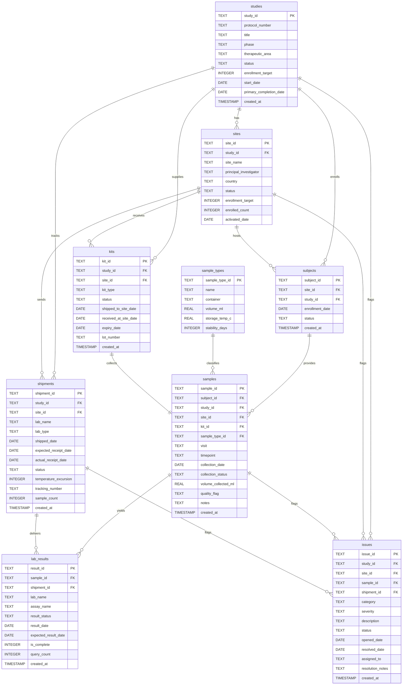

# Database Schema Diagram

```mermaid
erDiagram
    studies {
        TEXT study_id PK
        TEXT protocol_number
        TEXT title
        TEXT phase
        TEXT therapeutic_area
        TEXT status
        INTEGER enrollment_target
        DATE start_date
        DATE primary_completion_date
        TIMESTAMP created_at
    }

    sites {
        TEXT site_id PK
        TEXT study_id FK
        TEXT site_name
        TEXT principal_investigator
        TEXT country
        TEXT status
        INTEGER enrollment_target
        INTEGER enrolled_count
        DATE activated_date
    }

    subjects {
        TEXT subject_id PK
        TEXT site_id FK
        TEXT study_id FK
        DATE enrollment_date
        TEXT status
        TIMESTAMP created_at
    }

    sample_types {
        TEXT sample_type_id PK
        TEXT name
        TEXT container
        REAL volume_ml
        REAL storage_temp_c
        INTEGER stability_days
    }

    kits {
        TEXT kit_id PK
        TEXT study_id FK
        TEXT site_id FK
        TEXT kit_type
        TEXT status
        DATE shipped_to_site_date
        DATE received_at_site_date
        DATE expiry_date
        TEXT lot_number
        TIMESTAMP created_at
    }

    samples {
        TEXT sample_id PK
        TEXT subject_id FK
        TEXT study_id FK
        TEXT site_id FK
        TEXT kit_id FK
        TEXT sample_type_id FK
        TEXT visit
        TEXT timepoint
        DATE collection_date
        TEXT collection_status
        REAL volume_collected_ml
        TEXT quality_flag
        TEXT notes
        TIMESTAMP created_at
    }

    shipments {
        TEXT shipment_id PK
        TEXT study_id FK
        TEXT site_id FK
        TEXT lab_name
        TEXT lab_type
        DATE shipped_date
        DATE expected_receipt_date
        DATE actual_receipt_date
        TEXT status
        INTEGER temperature_excursion
        TEXT tracking_number
        INTEGER sample_count
        TIMESTAMP created_at
    }

    lab_results {
        TEXT result_id PK
        TEXT sample_id FK
        TEXT shipment_id FK
        TEXT lab_name
        TEXT assay_name
        TEXT result_status
        DATE result_date
        DATE expected_result_date
        INTEGER is_complete
        INTEGER query_count
        TIMESTAMP created_at
    }

    issues {
        TEXT issue_id PK
        TEXT study_id FK
        TEXT site_id FK
        TEXT sample_id FK
        TEXT shipment_id FK
        TEXT category
        TEXT severity
        TEXT description
        TEXT status
        DATE opened_date
        DATE resolved_date
        TEXT assigned_to
        TEXT resolution_notes
        TIMESTAMP created_at
    }

    studies ||--o{ sites : "has"
    studies ||--o{ subjects : "enrolls"
    studies ||--o{ kits : "supplies"
    studies ||--o{ shipments : "tracks"
    studies ||--o{ issues : "flags"

    sites ||--o{ subjects : "hosts"
    sites ||--o{ kits : "receives"
    sites ||--o{ shipments : "sends"
    sites ||--o{ issues : "flags"

    subjects ||--o{ samples : "provides"

    sample_types ||--o{ samples : "classifies"

    kits ||--|| samples : "collects"

    samples ||--o{ lab_results : "yields"
    samples ||--o{ issues : "flags"

    shipments ||--o{ lab_results : "delivers"
    shipments ||--o{ issues : "flags"
```
